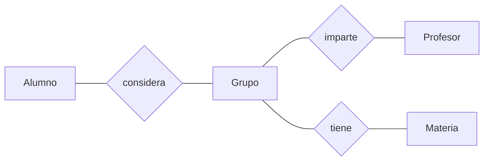

# Proyecto Generador de Horarios
> Este proyecto es una herramienta que facilita la planeación de horarios de los estudiantes del ITAM. Un alumno puede escoger y ordenar hasta cinco grupos por cada materia que desee inscribir; el programa generará los horarios posibles de forma automática, mostrando primero los que mejor coincidan con los grupos preferidos.

## Tabla de contenido
* [Información general](#información-general)
* [Tecnologías utilizadas](#tecnologías-utilizadas)
* [Features](#features)
* [Configuración](#configuración)
* [Esquema de la base de datos](#esquema-de-la-base-de-datos)
* [Uso](#uso)
* [Estado del proyecto](#estado-del-proyecto)
* [Créditos](#Créditos)
* [Contacto](#contact)

## Información general
- La idea de este proyecto surgió a partir de nuestra experiencia con el sistema de horarios del [ITAM](https://grace.itam.mx/)

## Tecnologías utilizadas
- Visual Studio 2019
- Microsoft SQL Server Management Studio 18

## Funciones
- Crear una cuenta de usuario para guardar los horarios generados
- Agregar hasta 10 materias y hasta 5 grupos por cada materia
- Ordenar los grupos de mayor a menor prioridad
- Generar hasta 50 horarios, ordenados de acuerdo a las preferencias del usuario
- Cambiar el nombre de usuario o la contraseña

## Configuración
1. Descargar el archivo QueryTablasBD
2. Abrir Microsoft SQL Server Management Studio 18
3. Abrir QueryTablasBD y ejecutarlo para crear la base de datos

5. Descargar ProyectoGeneradorHorarios.zip

6. Extraer la carpeta del zip

7. Ejecutar GeneradorHorarios.exe 

## Esquema de la base de datos

## Uso
### Inicio de sesión
En la pestaña de inicio de sesión, ingresar con las credenciales:
   - Cuenta: admin
   - Contraseña: admin

  o crear una nueva cuenta
### Agregar materias y grupos

### Generar horarios

#### Borrar materias

## Estado del proyecto
- Funcional. Aún hay aspectos que mejorar o implementar.

Aspectos por mejorar:
- Hacer más seguro el sistema de cuentas
- Hacer más clara y atractiva la interfaz

Por hacer:
- Implementar la inscripción de materias con laboratorios
- Enlazar el programa con la base de datos del ITAM
- Agregar opciones de accesibilidad (por ejemplo, modo oscuro)

## Créditos
- El diseño de la interfaz fue inspirado por el [generador de horarios](https://generador-horarios-itam.firebaseapp.com/#/carreras) hecho por Fernando Ruiloba y Pedro Lanzagorta 

## Contacto
Creado por:
+ Fabio G. Calo Dizy (fcalodiz@itam.mx)
+ Salvador Alejandro Uribe Calva (suribeca@itam.mx)
+ Alan Vivanco Córdoba (alan.vivanco@itam.mx)

⢀⣠⣾⣿⣿⣿⣿⣿⣿⣿⣿⣿⣿⣿⣿⣿⣿⣿⣿⣿⣿⣿⠀⠀⠀⠀⣠⣤⣶⣶
⣿⣿⣿⣿⣿⣿⣿⣿⣿⣿⣿⣿⣿⣿⣿⣿⣿⣿⣿⣿⣿⣿⠀⠀⠀⢰⣿⣿⣿⣿
⣿⣿⣿⣿⣿⣿⣿⣿⣿⣿⣿⣿⣿⣿⣿⣿⣿⣿⣿⣿⣿⣿⣧⣀⣀⣾⣿⣿⣿⣿
⣿⣿⣿⣿⣿⡏⠉⠛⢿⣿⣿⣿⣿⣿⣿⣿⣿⣿⣿⣿⣿⣿⣿⣿⣿⣿⣿⣿⡿⣿
⣿⣿⣿⣿⣿⣿⠀⠀⠀⠈⠛⢿⣿⣿⣿⣿⣿⣿⣿⣿⣿⣿⣿⣿⠿⠛⠉⠁⠀⣿
⣿⣿⣿⣿⣿⣿⣧⡀⠀⠀⠀⠀⠙⠿⠿⠿⠻⠿⠿⠟⠿⠛⠉⠀⠀⠀⠀⠀⣸⣿
⣿⣿⣿⣿⣿⣿⣿⣷⣄⠀⡀⠀⠀⠀⠀⠀⠀⠀⠀⠀⠀⠀⠀⠀⠀⠀⢀⣴⣿⣿
⣿⣿⣿⣿⣿⣿⣿⣿⣿⠏⠀⠀⠀⠀⠀⠀⠀⠀⠀⠀⠀⠀⠀⠀⠠⣴⣿⣿⣿⣿
⣿⣿⣿⣿⣿⣿⣿⣿⡟⠀⠀⢰⣹⡆⠀⠀⠀⠀⠀⠀⣭⣷⠀⠀⠀⠸⣿⣿⣿⣿
⣿⣿⣿⣿⣿⣿⣿⣿⠃⠀⠀⠈⠉⠀⠀⠤⠄⠀⠀⠀⠉⠁⠀⠀⠀⠀⢿⣿⣿⣿
⣿⣿⣿⣿⣿⣿⣿⣿⢾⣿⣷⠀⠀⠀⠀⡠⠤⢄⠀⠀⠀⠠⣿⣿⣷⠀⢸⣿⣿⣿
⣿⣿⣿⣿⣿⣿⣿⣿⡀⠉⠀⠀⠀⠀⠀⢄⠀⢀⠀⠀⠀⠀⠉⠉⠁⠀⠀⣿⣿⣿
⣿⣿⣿⣿⣿⣿⣿⣿⣧⠀⠀⠀⠀⠀⠀⠀⠈⠀⠀⠀⠀⠀⠀⠀⠀⠀⠀⢹⣿⣿
⣿⣿⣿⣿⣿⣿⣿⣿⣿⠃⠀⠀⠀⠀⠀⠀⠀⠀⠀⠀⠀⠀⠀⠀⠀⠀⠀⢸⣿⣿
