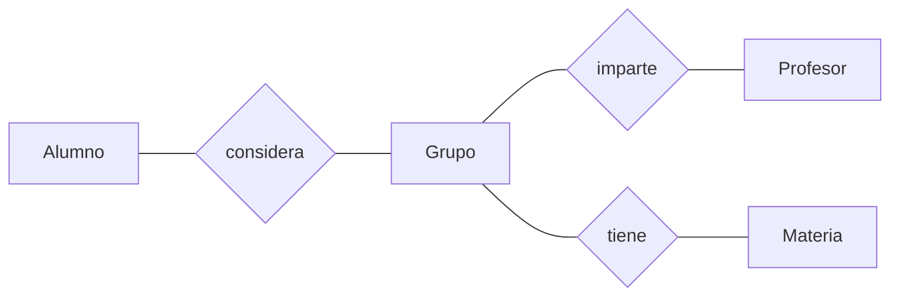

# Proyecto Generador de Horarios
> Este proyecto es una herramienta que facilita la planeación de horarios de los estudiantes del ITAM. Un alumno puede escoger y ordenar hasta cinco grupos por cada materia que desee inscribir; el programa generará los horarios posibles de forma automática, mostrando primero los que mejor coincidan con los grupos preferidos.

## Tabla de contenido
* [Información general](#información-general)
* [Programas utilizados](#programas-utilizados)
* [Features](#features)
* [Setup](#setup)
* [Esquema de la base de datos](#esquema-de-la-base-de-datos)
* [Usage](#usage)
* [Estado del proyecto](#estado-del-proyecto)
* [Aspectos por mejorar](#aspectos-por-mejorar)
* [Créditos](#Créditos)
* [Contacto](#contact)

## Información general
- La idea de este proyecto surgió a partir de nuestra experiencia con el sistema de horarios del [ITAM](https://grace.itam.mx/)

## Tecnologías utilizados
- Visual Studio 2019
- Microsoft SQL Server Management Studio 18

## Funciones
- 

## Setup

## Esquema de la base de datos

## Usos

## Estado del proyecto
- Funcional. Aún hay aspectos que mejorar o implementar.

## Aspectos por mejorar
Por mejorar:
- Hacer más seguro el sistema de cuentas
- Hacer más clara y atractiva la interfaz

Por hacer:
- Implementar la inscripción de materias con laboratorios
- Enlazar el programa con la base de datos del ITAM
- Agregar opciones de accesibilidad (por ejemplo, modo oscuro)

## Créditos
- El diseño de la interfaz fue inspirado por el [generador de horarios](https://generador-horarios-itam.firebaseapp.com/#/carreras) hecho por Fernando Ruiloba y Pedro Lanzagorta 

## Contacto
Creado por:
+ Fabio G. Calo Dizy (fcalodiz@itam.mx)
+ Salvador Alejandro Uribe Calva (suribeca@itam.mx)
+ Alan Vivanco Córdoba (alan.vivanco@itam.mx)

⢀⣠⣾⣿⣿⣿⣿⣿⣿⣿⣿⣿⣿⣿⣿⣿⣿⣿⣿⣿⣿⣿⠀⠀⠀⠀⣠⣤⣶⣶
⣿⣿⣿⣿⣿⣿⣿⣿⣿⣿⣿⣿⣿⣿⣿⣿⣿⣿⣿⣿⣿⣿⠀⠀⠀⢰⣿⣿⣿⣿
⣿⣿⣿⣿⣿⣿⣿⣿⣿⣿⣿⣿⣿⣿⣿⣿⣿⣿⣿⣿⣿⣿⣧⣀⣀⣾⣿⣿⣿⣿
⣿⣿⣿⣿⣿⡏⠉⠛⢿⣿⣿⣿⣿⣿⣿⣿⣿⣿⣿⣿⣿⣿⣿⣿⣿⣿⣿⣿⡿⣿
⣿⣿⣿⣿⣿⣿⠀⠀⠀⠈⠛⢿⣿⣿⣿⣿⣿⣿⣿⣿⣿⣿⣿⣿⠿⠛⠉⠁⠀⣿
⣿⣿⣿⣿⣿⣿⣧⡀⠀⠀⠀⠀⠙⠿⠿⠿⠻⠿⠿⠟⠿⠛⠉⠀⠀⠀⠀⠀⣸⣿
⣿⣿⣿⣿⣿⣿⣿⣷⣄⠀⡀⠀⠀⠀⠀⠀⠀⠀⠀⠀⠀⠀⠀⠀⠀⠀⢀⣴⣿⣿
⣿⣿⣿⣿⣿⣿⣿⣿⣿⠏⠀⠀⠀⠀⠀⠀⠀⠀⠀⠀⠀⠀⠀⠀⠠⣴⣿⣿⣿⣿
⣿⣿⣿⣿⣿⣿⣿⣿⡟⠀⠀⢰⣹⡆⠀⠀⠀⠀⠀⠀⣭⣷⠀⠀⠀⠸⣿⣿⣿⣿
⣿⣿⣿⣿⣿⣿⣿⣿⠃⠀⠀⠈⠉⠀⠀⠤⠄⠀⠀⠀⠉⠁⠀⠀⠀⠀⢿⣿⣿⣿
⣿⣿⣿⣿⣿⣿⣿⣿⢾⣿⣷⠀⠀⠀⠀⡠⠤⢄⠀⠀⠀⠠⣿⣿⣷⠀⢸⣿⣿⣿
⣿⣿⣿⣿⣿⣿⣿⣿⡀⠉⠀⠀⠀⠀⠀⢄⠀⢀⠀⠀⠀⠀⠉⠉⠁⠀⠀⣿⣿⣿
⣿⣿⣿⣿⣿⣿⣿⣿⣧⠀⠀⠀⠀⠀⠀⠀⠈⠀⠀⠀⠀⠀⠀⠀⠀⠀⠀⢹⣿⣿
⣿⣿⣿⣿⣿⣿⣿⣿⣿⠃⠀⠀⠀⠀⠀⠀⠀⠀⠀⠀⠀⠀⠀⠀⠀⠀⠀⢸⣿⣿
