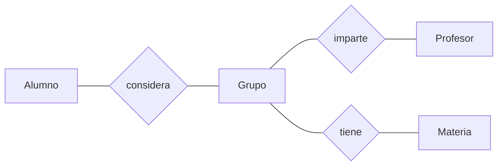

# Proyecto Generador de Horarios
Herramienta que facilita la planeación de horarios de los estudiantes del ITAM. Un alumno puede escoger y ordenar hasta cinco grupos por cada materia que desee inscribir; el programa generará los horarios posibles de forma automática, mostrando primero los que mejor coincidan con los grupos preferidos.

## Tabla de contenido
* [Información general](#información-general)
* [Tecnologías utilizadas](#tecnologías-utilizadas)
* [Funciones](#funciones)
* [Esquema de la base de datos](#esquema-de-la-base-de-datos)
* [Uso](#uso)
* [Por hacer](#por-hacer)
* [Créditos](#Créditos)
* [Contacto](#contacto)

## Información general
- La idea de este proyecto surgió a partir de nuestra experiencia con el sistema de horarios del [ITAM](https://grace.itam.mx/), dado que planear el horario de un semestre puede ser muy tardado y tedioso
- Se desarrolló para la materia Desarrollo de Aplicaciones Informáticas en otoño de 2020

## Tecnologías utilizadas
- Visual Studio 2019
- Microsoft SQL Server Management Studio 18

## Funciones
- Crear una cuenta de usuario para guardar los horarios generados
- Agregar hasta 10 materias y hasta 5 grupos por cada materia
- Ordenar los grupos de mayor a menor prioridad
- Generar hasta 50 horarios, ordenados de acuerdo a las preferencias del usuario
- Cambiar el nombre de usuario o la contraseña

## Esquema de la base de datos

## Uso
#### Configuración
1. Descarga el archivo QueryTablasBD
2. Abre Microsoft SQL Server Management Studio 18
3. Abre QueryTablasBD y ejecútalo para crear la base de datos

4. Descarga ProyectoGeneradorHorarios.zip
5. Extrae la carpeta del zip
6. Ejecuta GeneradorHorarios.exe 

#### Inicio de sesión
En la pestaña de inicio de sesión, crea una nueva cuenta o ingresa con las credenciales:
   - Cuenta: admin
   - Contraseña: admin

Para cambiar el nombre de usuario o contraseña, entra a Configuración después de iniciar sesión.

### Ventana Principal

Desde la ventana principal se puede acceder a las distintas funciones del programa. Desde aquí se pueden añadir materias, seleccionándolas de la lista para luego buscar sus grupos.

### Ordenar materias y grupos
En esta pestaña se pueden añadir los grupos en orden de preferencia para la materia previamente seleccionada.

Una vez seleccionado el orden deseado, hay que dar click en confirmar para completar la operación.

### Borrar materias
También se puede eliminar la materia de la lista del alumno con el botón "eliminar materia".

### Generar horarios
Una vez se tengan las materias a inscribir con sus grupos ordenados por preferencia, el botón Generar Horarios generará varias opciones de horarios.

## Por hacer
- Implementar la inscripción de materias con laboratorios
- Enlazar el programa con la base de datos del ITAM
- Agregar opciones de accesibilidad (por ejemplo, modo oscuro)
- Hacer más seguro el sistema de cuentas
- Hacer más clara y atractiva la interfaz

## Créditos
El diseño de la interfaz fue inspirado por el [generador de horarios](https://generador-horarios-itam.firebaseapp.com/#/carreras) hecho por Fernando Ruiloba y Pedro Lanzagorta 

## Contacto
Creado por:
+ Fabio G. Calo Dizy (fcalodiz@itam.mx)
+ Salvador Alejandro Uribe Calva (suribeca@itam.mx)
+ Alan Vivanco Córdoba (alan.vivanco@itam.mx)

