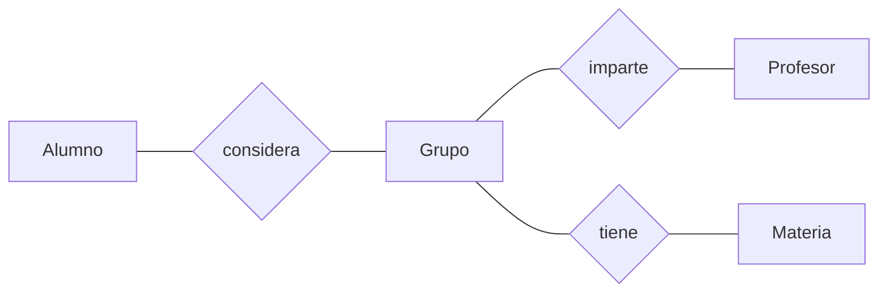

# Proyecto Generador de Horarios
> Este proyecto es una propuesta para mejorar el sistema de meter horarios dentro del ITAM con varias opciones de horarios generados automáticamente según las preferencias del alumno.

## Tabla de contenido
* [Información general](#información-general)
* [Programas utilizados](#programas-utilizados)
* [Features](#features)
* [Screenshots](#screenshots)
* [Esquema de la base de datos](#esquema-de-la-base-de-datos)
* [Setup](#setup)
* [Usage](#usage)
* [Estado del proyecto](#estado-del-proyecto)
* [Aspectos por mejorar](#aspectos-por-mejorar)
* [Créditos](#Créditos)
* [Contacto](#contact)

## Información general

## Programas utilizados
- Visual Studio 2019
- Microsoft SQL Server Management Studio 18

## Features

## Screenshots

## Esquema de la base de datos

## Setup

## Usage

## Estado del proyecto
- En proceso de ser implementado 

## Aspectos por mejorar
Por mejorar:
- Mejorar el sistema de cuentas
- Mejorar claridad de interfaz

Por hacer:
- Implementar el inscribir materias con laboratorios
- Enlazar programa con base de datos del ITAM

## Créditos
- La idea de este proyecto surgió a partir de la experiencia tenida con el sistema de horarios del [ITAM](https://grace.itam.mx/)
- Este proyecto está basado en el [generador de horarios](https://horarios-itam.firebaseapp.com/) hecho por Fernando Ruiloba y Pedro Lanzagorta 

## Contacto
Creado por:
+ Fabio Calo Dizy
+ Salvador Alejandro Uribe Calva	
+ Alan Vivanco Córdoba

⢀⣠⣾⣿⣿⣿⣿⣿⣿⣿⣿⣿⣿⣿⣿⣿⣿⣿⣿⣿⣿⣿⠀⠀⠀⠀⣠⣤⣶⣶
⣿⣿⣿⣿⣿⣿⣿⣿⣿⣿⣿⣿⣿⣿⣿⣿⣿⣿⣿⣿⣿⣿⠀⠀⠀⢰⣿⣿⣿⣿
⣿⣿⣿⣿⣿⣿⣿⣿⣿⣿⣿⣿⣿⣿⣿⣿⣿⣿⣿⣿⣿⣿⣧⣀⣀⣾⣿⣿⣿⣿
⣿⣿⣿⣿⣿⡏⠉⠛⢿⣿⣿⣿⣿⣿⣿⣿⣿⣿⣿⣿⣿⣿⣿⣿⣿⣿⣿⣿⡿⣿
⣿⣿⣿⣿⣿⣿⠀⠀⠀⠈⠛⢿⣿⣿⣿⣿⣿⣿⣿⣿⣿⣿⣿⣿⠿⠛⠉⠁⠀⣿
⣿⣿⣿⣿⣿⣿⣧⡀⠀⠀⠀⠀⠙⠿⠿⠿⠻⠿⠿⠟⠿⠛⠉⠀⠀⠀⠀⠀⣸⣿
⣿⣿⣿⣿⣿⣿⣿⣷⣄⠀⡀⠀⠀⠀⠀⠀⠀⠀⠀⠀⠀⠀⠀⠀⠀⠀⢀⣴⣿⣿
⣿⣿⣿⣿⣿⣿⣿⣿⣿⠏⠀⠀⠀⠀⠀⠀⠀⠀⠀⠀⠀⠀⠀⠀⠠⣴⣿⣿⣿⣿
⣿⣿⣿⣿⣿⣿⣿⣿⡟⠀⠀⢰⣹⡆⠀⠀⠀⠀⠀⠀⣭⣷⠀⠀⠀⠸⣿⣿⣿⣿
⣿⣿⣿⣿⣿⣿⣿⣿⠃⠀⠀⠈⠉⠀⠀⠤⠄⠀⠀⠀⠉⠁⠀⠀⠀⠀⢿⣿⣿⣿
⣿⣿⣿⣿⣿⣿⣿⣿⢾⣿⣷⠀⠀⠀⠀⡠⠤⢄⠀⠀⠀⠠⣿⣿⣷⠀⢸⣿⣿⣿
⣿⣿⣿⣿⣿⣿⣿⣿⡀⠉⠀⠀⠀⠀⠀⢄⠀⢀⠀⠀⠀⠀⠉⠉⠁⠀⠀⣿⣿⣿
⣿⣿⣿⣿⣿⣿⣿⣿⣧⠀⠀⠀⠀⠀⠀⠀⠈⠀⠀⠀⠀⠀⠀⠀⠀⠀⠀⢹⣿⣿
⣿⣿⣿⣿⣿⣿⣿⣿⣿⠃⠀⠀⠀⠀⠀⠀⠀⠀⠀⠀⠀⠀⠀⠀⠀⠀⠀⢸⣿⣿
